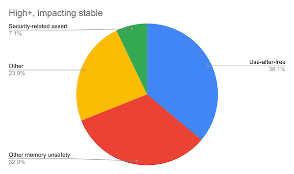
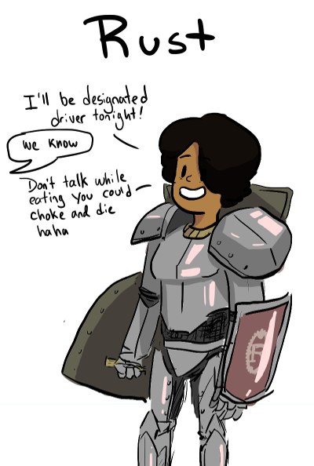

Hello World
----

```rust
fn main()
{
    println!("Hello, World")
}
```

Hello X!
--------
```rust
fn hello(name: &str) -> String
{
    format!("Hello, {}!", name)
}

fn main() {
    let name = String::from("Rust");
    println!("{}", hello(&name));
}
```

What is Rust?
----

* System language like C++, started at Mozilla
* Main focus
    * Safety (memory, threading ...)
    * Speed (same league as C/C++)
    * Good compiler errors
* Very new language (1.0: 2015), rapid development, e.g. new futures/async
    * "[Editions](https://doc.rust-lang.org/edition-guide/editions/index.html)" to stabilize language
    * Currently Edition 2015 and 2018
* [Used in](https://github.com/rust-unofficial/awesome-rust): Firefox, System/[Embedded](https://rust-embedded.github.io/book) Programming, [OS](https://www.redox-os.org)/Kernel, Web(assembly)

Tooling
---
* Compiler - rustc, based on LLVM
* `rustup` for release management
    * stable/beta/nightly releases
    * cross compilers
* Build tool / packaging: cargo + [crates.io](https://crates.io)
* rustfmt, rustdoc
* IDEs: Vim, VS Code ("Racer" plugin), CLion ...
```bash     
cargo new --bin MyProject
cargo build
cargo run
```

Great Documentation
----
* On doc.rust-lang.org
    * [Learning Rust Overview](https://www.rust-lang.org/learn)
    * [Rust Programming Language](https://doc.rust-lang.org/book/title-page.html)
    * [Rust By Example](https://doc.rust-lang.org/stable/rust-by-example)
    * [Rust Reference](https://doc.rust-lang.org/reference/index.html)
    * [Rustonomicon](https://doc.rust-lang.org/nomicon/) (The Dark Arts of Unsafe Rust)
* Others
    * [Rust Cookbook](https://rust-lang-nursery.github.io/rust-cookbook)
    * [Async Programming in Rust](https://rust-lang.github.io/async-book)
    * [Rustlings](https://github.com/rust-lang/rustlings)
    

Constants & Variables
----
```rust
let x = 42; // immutable integer
let mut y: i32 = 1; // mutable integer
let z =  y as u8; // explicit conversion

const  THRESHOLD : i32 = 10; // unchangeable value, type required!
static LANG: &str = "Rust"; // global with static lifetime
                            //  may be mut, access is unsafe!
```

Data Types - Primitive Types
----
* `bool`, `char` (4 byte char)
* Scalars
    * Integer: `i8`, `i16`, `i32`, `i64`, `u8`, `u16`, `u32`, `u64`, `isize`, `usize` (default `i32`)
    * Floats:  `f32`, `f64` (default `f64`)
    ```rust
    let x = 2.0; // f64
    let y: f32 = 3.0; // f32
    let z = 3.14f32; // f32 literal, works for int types too
    ```

Data Type - Compound Types
----
```rust
// Array
let array: [i32; 5] = [0,1,2,3,4];
// Slice
let slice = &array[0..3]; // 0,1,2
// str - a string slice
let s = "hello";
// Tuple
let tup = ("hello", 42, "world", [1,2,3]);
// Vec (like std::vector)
let v = vec![1,2,3];
// String - UTF-8 encoded growable string, like Vec<char>
let s = String::from("💖");
let v = vec![0xF0, 0x9F, 0x98, 0x88];
let t = String::from_utf8(v).unwrap();
```

Functions
----

```rust
fn negate(i: i32) -> i32 { -i }

use std::fmt;
pub fn func_name<T: fmt::Display>(arg1: T) -> String {}
{
    println!("{}", arg1); // guaranteed to work by Type bound
    format!("{}", arg1)   
}

// negate only accessible in same module
```

Data Types - Structs
----
```rust
struct Nil; // empty
struct Pair(i32, i64); // tuple struct (named tuple)
```
```rust
#[derive(Debug)]
struct Person<'a> { // Struct with two fields and lifetime
    name: &'a str,
    age: u8
}
impl Person<'_> { // anonymous lifetime
    // const method
    fn greet(&self) -> String {
        format!("Hello, {}", self.name)
    }
}
println!("{}", Person{name: "Isabelle", age: 1}.greet());
```

Data Types - Struct Error
----
* Person def without lifetime on &str would be error
```bash
error[E0106]: missing lifetime specifier
 --> src/main.rs:4:11
  |
4 |     name: &str,
  |           ^ expected lifetime parameter
```
* Anonynous lifetime optional, marks that lifetime is inferred

Data Types - Enums
----
Much more powerful than in C++

```rust
enum Message {
    Quit,
    ChangeColor(i32, i32, i32),
    Move {x: i32, y: i32},
    Write(String)
}
let x: Message = Message::Move{ x: 1, y: 2};
```

Matching
----
`match` is like a powerful switch / `if` cascade

```rust
let x = 2;
let as_string = match x {
    1 => "one",
    2 => "two",
    _ => "sorry, can only count to two..."
};
```
Match needs to be *exhaustive* (thus the `_`)

Matching and Enums
----
Bind values from variant for use in match

```rust
fn receive(msg: Message) {
    match msg {
        Message::Quit => panic!("we want to leave FAST!"),
        Message::ChangeColor(r,g,b) => change_color(r,g,b),
        Message::Move {x: x, y: y} => move_cursor(x, y),
        Message::Write(s) => println!("{}", s),
    }
}
```

Control Flow
----
```rust
if x % 2 == 0 { println!("x is even!"); } 
else { println!("x is odd!"); }

// infinite loop without break
loop { println!("I'm alive!"); break; } 

let mut i = 0;
while i < 10 { println!("hello"); i = i + 1; }
```
```rust
let mut x = vec!["C++", "Rust", "Go", "Python"];
for text in x { println!("I like {}.", text); }
for (i, text) in v.iter().enumerate() { /* ... use i, text */ }

while let Some(y) = x.pop() { /* ... use y */ }

for n in 1..11 { /* ... use n */ }
```

Lambdas
----
```rust
// lambda:
let a = "Hello"; let b = ", world";

// types inferred, b captured:
let x = |in| String::from(in) + b;

// with type annotations:
let y = |in: &str| -> String { ... }

println!("{}", x(a));
```

Constructors / Destructors
----
* Copy vs. Clone
```rust
// "constructors" just a convention!
impl<T> Vec<T> {
    pub fn new() -> Vec<T> { /* ... */ }
}
```
```rust
use vec::Vec;
let mut v = Vec::new();
// actually, for Vec there is a macro:
let mut w = vec![1,2,3];
```

```rust
// Desrtuctors implement std::ops::Drop::drop
impl Drop for X {
    fn drop(&mut self) {}
}
```


Error Handling
----
Rust uses Result<T,E> type for Error Handling (no exceptions)
```rust
#[must_use]
enum Result<T, E> { Ok(T), Err(E) }

fn may_fail(in: &str) -> Result<i32, ParseIntError> {
    let x = in.parse::<u8>(); // from trait std::str::FromStr
    // let y = x.unwrap(); -- will panic if error, often found in examples
    match x {
        Ok(i) => println!("The number is {}", i),
        Err(e) => { println!("{:?}", e); return e; } // #[derive(Debug)]
    }
    // Shortcuts:
    return in.parse<i32>()?;
    return try!(in.parse<i32>());
}
```

Traits
----
```rust
trait Format {
    fn format(&self) -> String;
    // default impl
    fn print(&self) { println!("{}", format(self)); }
}
```
```rust
impl Format for i32 {
    fn format(&self) -> String {
        format!("Int({})", self)
    }
}
impl Format for f64 {
    fn format(&self) -> String { 
        format!("Double({})", self)
    }
}
```
* Impl only allowed in either trait module or type module!
* No inheritance!

Trait Objects
----
```rust
let x = 42;
let y = 3.14;
let v: Vec<&dyn Format> = vec![&x, &y];

for it in v { println!("Item: {}". it.format()); }

fn do_static<T: Format>(x: T) { println!("{}", x.format()); }
fn do_dynRef(x: &dyn Format) { println!("{}", x.format()); }
fn do_dynPtr(x: Box<dyn Format>) { x.print(); }

do_static(x);
do_dynRef(&y);
do_dynPtr(Box::new(666));
```

Safety
----
Two languages: SAFE Rust and UNSAFE Rust

* Safe Rust - Compiler ENFORCES lifetimes and sharing rules, sane defaults:
    * Automated bounds / integer checks, PANIC!
    * Borrow checking / reference integrity checks
    * Variables / references immutable by default, no implicit copies etc
    * No Undefined Behavior in SAFE Rust !
    
* Unsafe Rust - disable checks in unsafe {} scope
    * Semantic: "the developer has verified that this works!"
    * E.g. unsafe traits Send / Sync

Memory Safety: Microsoft
----


Memory Safety: Chromium (see Chromium.org Security -> Memory Safety)
----
"Around 70% of our high severity security bugs are memory unsafety problems (that is, mistakes with C/C++ pointers). Half of those are use-after-free bugs."


Ownership
----
* Three ownership rules:
    * Each vaule in Rust has a variable that's called its _owner_
    * There can only be one owner at a time
    * When the owner goes out of scope, the value will be dropped

* All rules enforced at compile time - no runtime overhead!
    * But learning overhead: "fighting the borrow checker"

* References use lifetimes - may never outlive referent!
    * Lifetime annotations to help borrow checker

References & Borrowing
----
```rust
let s = String::from("fump");
let s2 = s;
println!("{}", s); // ERROR, s moved, String does not implement Copy!
```
```rust
fn change(some_string: &String) { // needs mutable ref!
    some_string.push_str("bar");
}
fn main() {
    let mut s = String::from("foo");
    change(&s); // needs mutable ref!
}
```

Compiler Error
----
```bash
error[E0596]: cannot borrow `*some_string` as mutable, as it is behind a `&` reference
 --> src/main.rs:2:5
  |
1 | fn change(some_string: &String) {
  |                        ------- help: consider changing this to be a mutable 
                                         reference: `&mut std::string::String`
2 |     some_string.push_str(", world");
  |     ^^^^^^^^^^^ `some_string` is a `&` reference, so the data it refers to cannot 
                     be borrowed as mutable
```

Mutable Borrow
----

```rust
let mut s = String::from("foo");
let r1 = &mut s;
let r2 = &mut s;
println!("{}, {}", r1, r2);
```

* Compiler Error
```bash
error[E0499]: cannot borrow `s` as mutable more than once at a time
 --> src/main.rs:4:14
  |
3 |     let r1 = &mut s;
  |              ------ first mutable borrow occurs here
4 |     let r2 = &mut s;
  |              ^^^^^^ second mutable borrow occurs here
5 |     println!("{} {}", r1, r2);
  |                       -- first borrow later used here
```

Local Lifetimes - Annotations
----
```rust
let x = 1;
let y = &x;
let z = &y;
```
"desugared" (some invalid syntax)
```rust
'a: {
    let x: i32 = 42;
    'b: { // b "good enough"
        let y: &'b i32 = &'b x;
        'c: { // c "good enough"
            let z: &'c &'b i32 = &'c y;
        }

    }
}
```

Local Lifetimes - add outer lifetime
----
```rust
let x = 1;
let y = &x;
let z = &y;
z = y;
```
"desugared" (some invalid syntax)
```rust
'a: {
    let x: i32 = 42;
    'b: {
        let z: &'b i32;
        'c: {
            // must use 'b here because reference is passed to that scope
            let y: &'b i32 = &'b x;
            z = y;
        }

    }
}
```

Reference outliving referent
----
```rust
fn as_str(data: &u32) -> &str {
    let s = format!("{}", data);
    &s
}
// desugars to
fn as_str<'a>(data: &'a u32) -> &'a str {
    'b: {
        let s = format!("{}", data);
        return &'a s;
    }
}
```
* ref to s must outlive 'a, but defined in 'b, which is inside 'a -> ERROR

Area covered by Lifetimes
----
```rust

let mut data = vec![1, 2, 3];
let x = &data[0];
println!("{}", x);
// This is OK, x is no longer needed
data.push(4);
```
```rust
let mut data = vec![1, 2, 3];
let x = &data[0];
data.push(4);
// This fails
println!("{}", x);
```
```rust
// ... also ok
if (condition()) {
    println!("{}", x);
    data.push(4);
} else {
    data.push(5);
}
```

Aliasing mutable references
----
```rust
let mut data = vec![1,2,3];
let x = &data[0];
data.push(4);
println!("{}", x);
```
```rust
// desugares to
'a: {
    let mut data: Vec<i32> = vec![1,2,3];
    'b: { // needs to cover the println for x
        let x: &'b i32 = Index::index<'b>(&'b data, 0);
        'c: {
            // temporary, cause we don't need &mut data longer
            Vec::pus(&'c mut data, 4);
        }
        println!("{}", x);
    }
}
```
* Intuitively: live shared ref to x, try to take mutable ref to data -> ERROR
* But: compiler just sees index 'b ref to data and inside 'c mut ref to data -> ERROR

Lifetimes and Slices / Arrays
----
* Lifetimes are *dumb*, just markers, but fail on the "safe side"
    * Disallow some valid code, but don't allow errors!
* Checker understands disjount struct fields, but not slices / arrays
* Works most of the time, sometimes needs help, sometimes requires `unsafe`

```rust
let mut x = [1,2,3];
let a = &mut x[0];
let b = &mut x[1];
// unsafe fix:
fn split_at_mut(&mut self, mid: usize) -> (&mut [T], &mut [T]);
```
```bash
error[E0499]: cannot borrow `x[..]` as mutable more than once at a time
 --> src/lib.rs:4:18
  |
3 |     let a = &mut x[0];
  |                  ---- first mutable borrow occurs here
4 |     let b = &mut x[1];
  |                  ^^^^ second mutable borrow occurs here
5 |     println!("{} {}", a, b);
6 | }
  | - first borrow ends here
```

Lifetime Elision Examples (from [Nomicon](https://doc.rust-lang.org/nomicon/lifetime-elision.html) )
----
```rust
fn print(s: &str);                                      // elided
fn print<'a>(s: &'a str);                               // expanded

fn debug(lvl: usize, s: &str);                          // elided
fn debug<'a>(lvl: usize, s: &'a str);                   // expanded

fn substr(s: &str, until: usize) -> &str;               // elided
fn substr<'a>(s: &'a str, until: usize) -> &'a str;     // expanded
```
```rust
fn get_str() -> &str;                                   // ILLEGAL

fn frob(s: &str, t: &str) -> &str;                      // ILLEGAL

fn get_mut(&mut self) -> &mut T;                        // elided
fn get_mut<'a>(&'a mut self) -> &'a mut T;              // expanded

fn args<T: ToCStr>(&mut self, args: &[T]) -> &mut Command                  // elided
fn args<'a, 'b, T: ToCStr>(&'a mut self, args: &'b [T]) -> &'a mut Command // expanded

fn new(buf: &mut [u8]) -> BufWriter;                    // elided
fn new<'a>(buf: &'a mut [u8]) -> BufWriter<'a>          // expanded
```

Not covered but interesting
----
* [std](https://doc.rust-lang.org/std/) library
* [Cargo](https://doc.rust-lang.org/cargo/), [Modules and Packages](https://doc.rust-lang.org/book/ch07-00-managing-growing-projects-with-packages-crates-and-modules.html)
* Pointers/Wrappers - `Box<T>`, `Rc<T>`, `Arc<T>`, `Cell<T>`, `RefCell<T>`
* Standardized Serialization with [Serde](https://serde.rs/)
* Standardized SQL / ORM with [Diesel](http://diesel.rs/)
* Async / Await - see [Async Book](https://rust-lang.github.io/async-book/)
    * [Tokio](https://github.com/tokio-rs/tokio) / [Rayon](https://github.com/rayon-rs/rayon) async libs
    * [Rocket](https://rocket.rs/) / [Actix](https://github.com/actix/actix-web) web frameworks
* Advanced language features: "hygienic" Macros, Generics, FFI

Questions?
---


([from Leftover Salad - Programming Languages as People](http://leftoversalad.com/c/015_programmingpeople/))


* Microsoft Slide taken from [Microsoft MSRC Security Research Github](https://github.com/microsoft/MSRC-Security-Research/blob/master/presentations/2019_02_BlueHatIL/2019_01%20-%20BlueHatIL%20-%20Trends%2C%20challenge%2C%20and%20shifts%20in%20software%20vulnerability%20mitigation.pdf), also see [MSRC Blog](https://msrc-blog.microsoft.com/2019/07/16/a-proactive-approach-to-more-secure-code/)
* Rust Logo from [rust-lang.org](https://www.rust-lang.org)
